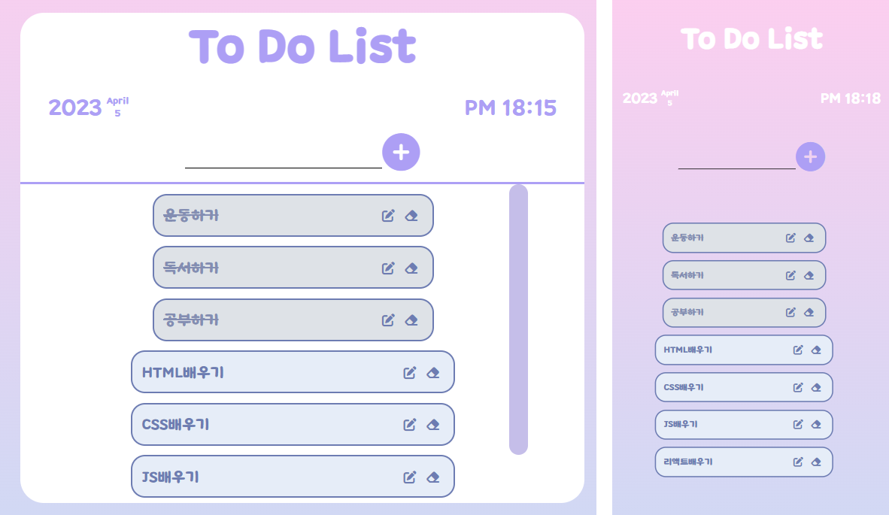

# To Do List
투두 리스트 만들기

## 🖥️ 프로젝트 소개
일정을 기록할 수 있는 To Do List입니다.

* 목적: Vanilla JS 실력 향상을 위해 필수적인 기능만 담은 스케줄러 구현

* 특이점: LocalStorage를 이용한 데이터 저장

## 🚀 기술스택

## 🚩 목표
✅ 날짜, 시간기능 구현

✅ 일정 추가, 삭제, 수정기능 구현
  
✅ 일정 토글기능 구현

✅ 공백문자 submit 방어코드

✅ 리스트 scroll: 리스트목록이 범위를 벗어나면 scroll 발생

✅ 글자수 제한: 15자 이상 작성 시 리스트에 추가하지 않고 경고창 띄움.

✅ 모바일 반응형 제작: @media를 사용하여 모바일 UI 구현

## 📝 수정해볼 사항
* 리액트를 사용하여 제작하기